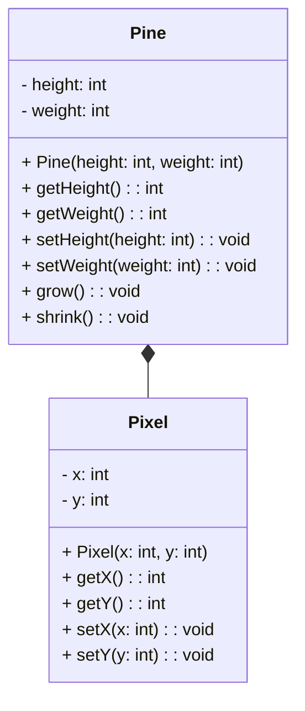

# TP 4

## Part I

### Question 1

- The Pine class attributes are : 
    -  `height` : the height of the pine
    -  `weight` : the weight of the pine

- The relation between the Pine and the Pixel class is a composition relation. The Pine class is composed of Pixel objects.

- The purpose of the Pine constructor is to initialize the attributes of the Pine class as well as the image of the pine.

## Part II

### Question 2

- The program compile
- The program run not as expected, this a is not swallow copy, it's a deep copy. The address of the pine ae not the same.
- The issue is that we don't use pointers to copy the Pine. We need to use pointers to copy the Pine.
- By default the copy is a swallow copy, we need to implement the copy constructor to make a deep copy.

